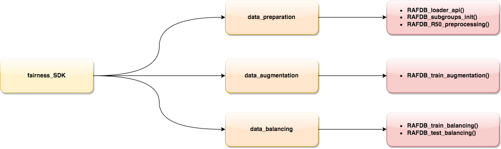

# fairness_sdk

fairness_sdk is a Python library developed for the project, aimed at addressing fairness concerns in machine learning models. It provides various sub-modules to facilitate data preparation, data augmentation, data visualization, data balancing, model testing, and model benchmarking.

## Sub-modules

The sub-modules available in fairness_sdk are as follows:

### data_preparation

This sub-module includes functions for loading and preparing the training and test data, primarily focusing on the RAF-DB dataset. It also encompasses feature engineering tasks.

### data_augmentation

The data_augmentation sub-module contains functions for performing data augmentation techniques. These techniques help increase the size of the training dataset and prevent overfitting.

### data_balancing

The data_balancing sub-module is responsible for balancing the training and test datasets. It includes functions to address any class imbalance issues and ensure fair representation of different classes.

## Usage

To use the fairness_sdk library, you need to import the desired sub-modules into your Python code. Each sub-module provides specific functionalities, making it easier to incorporate fairness considerations into your machine learning workflows.

For detailed usage instructions and examples, refer to the documentation within each sub-module.

## Contributing

Contributions to fairness_sdk are welcome! If you have any ideas, bug reports, or feature requests, please submit them via GitHub issues. Additionally, pull requests are encouraged for introducing new features or addressing existing issues.

## License

This project is licensed under the [MIT License](LICENSE).
